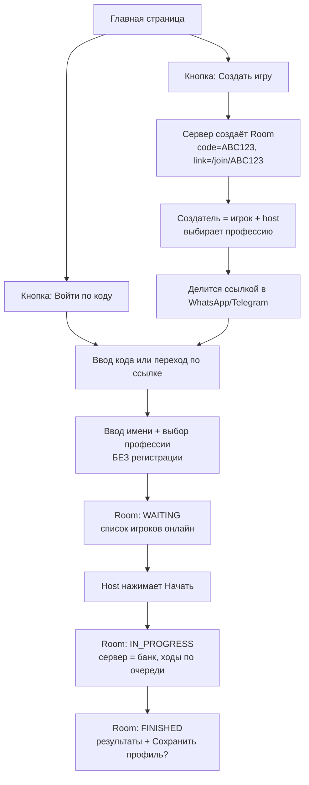

# CLAUDE.md — CashFlow Online (Board CashYou)

> Файл-инструкция для Claude Code. Читать перед любой задачей в этом репозитории.

---

## 0. Контекст проекта

**Что это:** мультиплеерная настольная игра по финансовой грамотности. 24 клетки, профессии, финансовый отчёт, сделки, рынок.

**Стек:**
- Backend: Go + Gin, WebSocket (gorilla/websocket), PostgreSQL
- Frontend: React + TypeScript + Vite
- Infra: Docker Compose, деплой Railway / Vercel / Neon
- Repo: `github.com/olzhas2357/cashflow` · Live: `cashflow-murex-seven.vercel.app`

**Что уже работает:** кубик, авто-расчёт финотчёта, лобби с кодом, машина состояний хода (`WAITING_ROLL → RESOLVING_CELL → AWAITING_DECISION → TURN_COMPLETE`), WS-синхронизация.

**Главная цель этого этапа:** любой человек может открыть ссылку, зайти с друзьями и сыграть партию **без человека-аудитора**. Продукт готов к тестированию на живых игроках.

---

## 1. Правила работы (обязательно)

1. **Не ломать то, что работает.** Перед изменением файла — прочитать его целиком.
2. **Один шаг = один коммит.** После каждого шага писать, что изменилось и как проверить.
3. **Сервер — источник правды.** Клиент никогда не считает деньги. Все транзакции только на бэкенде.
4. **Не писать код без плана.** Сначала короткий план (5–10 строк), потом реализация.
5. **Каждая фича = ручной тест-сценарий** (что нажать, что должно произойти).
6. **Спрашивать, если непонятно.** Не придумывать бизнес-логику молча.
7. Язык кода и коммитов — английский. Комментарии и ответы мне — русский.

**Definition of Done для любой задачи:**
- [ ] Собирается: `go build ./...` и `npm run build` без ошибок
- [ ] Работает в 2 браузерах одновременно (проверка мультиплеера)
- [ ] Обновление страницы (F5) не выкидывает игрока из игры
- [ ] В консоли браузера и в логах сервера нет ошибок

---

## 2. ЗАДАЧА 1 — Архитектура: игра без аудитора

### Ключевая идея
Аудитор больше не нужен, потому что **банк = сервер**. Человек не считает деньги — считает Go-бэкенд. Аудитор превращается из «обязательного банкира» в **опциональную роль ведущего**.

### Поток игры (основной, «Играю с друзьями»)



### Что реализовать

**Room (комната)**
| Поле | Значение |
|---|---|
| `code` | 6 символов, без похожих букв (без `0,O,1,I`) |
| `status` | `WAITING` / `IN_PROGRESS` / `FINISHED` |
| `host_player_id` | кто управляет комнатой |
| `host_plays` | `true` = хост играет, `false` = режим ведущего |
| `settings` | макс. игроков, лимит времени на ход, стартовый капитал |
| `expires_at` | TTL: `WAITING` — 2 часа, `IN_PROGRESS` — 24 часа |

**Права хоста:** старт игры, кик игрока, пауза, передача прав. Если хост отключился > 60 сек — права автоматически переходят следующему игроку (host handover). Комната не должна «умирать» вместе с хостом.

**Reconnect (критично для тестирования!)**
- при входе сервер выдаёт `playerToken` (UUID) → сохранить в `localStorage`
- F5 / потеря сети / закрытая вкладка → переподключение по `playerToken`, игрок возвращается в свою партию с тем же балансом
- игрок в состоянии `disconnected` не блокирует игру: таймер хода идёт, по истечении — авто-ход (бросок кубика + безопасное решение по умолчанию)

**Роль «Ведущий» (бывший аудитор) — опция, а не требование**
Тот же Room, но `host_plays = false`. Ведущий не имеет фишки на поле, а видит дашборд: финотчёты всех игроков, история транзакций, кнопки «пауза» и «объяснить». Нужно для школ, вузов, бootcamp-ов. Для друзей — просто выключено.

### Приоритет реализации
1. **Room-code + ссылка + гость** ← делаем сейчас, это разблокирует тестирование
2. Reconnect + host handover + таймер хода ← сразу после, без этого тест развалится
3. Режим «Ведущий» (переключатель при создании комнаты)
4. *Позже:* Quick Match (публичное лобби, случайные игроки, боты для заполнения мест)

---

## 3. ЗАДАЧА 2 — Логин и аккаунты

### Принцип: **guest-first**
Регистрация НЕ обязательна для входа в игру. Каждый экран регистрации до игры = потерянные тестировщики.

| Кто | Что нужно | Как |
|---|---|---|
| Игрок | ничего | имя + аватар → `playerToken` в localStorage |
| Игрок, который хочет сохранить статистику | аккаунт | предложить **после** финала партии |
| Хост (друзья) | ничего | гость может создать комнату |
| Ведущий / учитель | аккаунт | **сам регистрируется**, не создаём вручную |

### Регистрация — какие способы
1. **Telegram Login Widget** — рекомендую как основной для Казахстана: один тап, без пароля, у всех есть Telegram
2. **Google OAuth** — второй по важности
3. **Email + magic link** — для учителей и вузов (корпоративная почта)
4. Email + пароль — только если очень нужно (лишняя головная боль: сброс пароля, валидация)

### Технически
- `guestToken` (JWT, 24 ч, только для одной комнаты) и `userToken` (JWT, 30 дней)
- при регистрации после игры — **привязать результаты гостя к новому аккаунту** (`UPDATE players SET user_id = ... WHERE player_token = ...`)
- ручное создание аккаунтов админом — НЕ делаем, не масштабируется

### Спорный момент, требует решения
Анонимные комнаты = риск мусора и абьюза. Минимальная защита: rate limit на создание комнат по IP (например 5/час) + капча только при подозрении. Не усложнять раньше времени.

---

## 4. ЗАДАЧА 3 — Дизайн

**Статус: файл дизайна (Ghost Cursor, JS/HTML/CSS) НЕ прикрепился к сообщению — нужно загрузить заново.**

Когда файл будет:
1. Разобрать: какая часть — эффект курсора, какая — вёрстка лендинга
2. Не вставлять как есть. Портировать в React + TypeScript, разбить на компоненты
3. Эффект Ghost Cursor: только на десктопе (`pointer: fine`), отключить при `prefers-reduced-motion`, обязательно `cancelAnimationFrame` в cleanup — иначе утечка памяти и просадка FPS
4. Никаких тяжёлых эффектов на игровом поле — только на главной странице
5. Мобильный сначала: главный экран должен работать на 360px

**Требования к главной странице:**
- В центре — две кнопки: «Создать игру» и «Войти по коду». Ничего лишнего до них.
- Переключатель языка виден сразу (KZ / RU / EN)
- Правило: **от открытия сайта до входа в комнату — не больше 3 экранов**

---

## 5. ЗАДАЧА 4 — Три языка (KZ / RU / EN)

### Frontend
- `react-i18next`
- Структура: `src/locales/{kk,ru,en}/{common,game,cards,professions}.json`
- Выбор языка: URL `?lang=kk` → `localStorage` → `Accept-Language` → fallback `ru`
- Запретить хардкод текста в JSX. Только `t('key')`.

### Backend (контент карточек — здесь главная сложность)
Карточки Deal / Doodad / Market / Профессии хранятся в БД. Нужна отдельная таблица переводов, а не поля `title_ru`, `title_kk`, `title_en` (их потом невозможно поддерживать):

```sql
card_translations (card_id, lang, title, description)
PRIMARY KEY (card_id, lang)
```

Если перевода нет → fallback на `ru`, не пустая строка.

### Важное архитектурное решение
Язык — **у игрока, не у комнаты**. Сервер по WebSocket отправляет `card_id` + числовые данные, а не готовый текст. Каждый клиент показывает карточку на своём языке. Тогда в одной партии казахскоязычный, русскоязычный и англоязычный игроки играют вместе комфортно. Это сильная фича для питча.

### Порядок
1. Инфраструктура i18n + интерфейс (кнопки, меню, финотчёт)
2. Профессии
3. Карточки (самый большой объём — вынести в таблицу, чтобы переводить без программиста)

---

## 6. ЗАДАЧА 5 — Исправить ошибку Vite

```
[vite] ws proxy socket error: Error: write EPIPE ... (x2)
```

**Диагноз:** Vite проксирует WebSocket на Go-бэкенд. Клиент закрывает соединение, Vite пишет в уже закрытый сокет → `EPIPE`. Пометка **`(x2)`** — почти наверняка React `StrictMode`: в dev эффект монтируется дважды → два WS-подключения, одно сразу рвётся.

**Порядок исправления:**

**Шаг 1 — клиент (главная причина).** Найти `useEffect`, где создаётся WebSocket:
- singleton WS-клиент вне компонента (или `useRef`), а не новый socket на каждый рендер
- в cleanup: `socket.close()`, снять все listeners
- guard: не подключаться, если `readyState === CONNECTING || OPEN`
- reconnect с exponential backoff, без бесконечного цикла

**Шаг 2 — vite.config.ts:** явно настроить прокси и заглушить шум:

```ts
server: {
  proxy: {
    '/ws': {
      target: 'ws://localhost:8080',
      ws: true,
      changeOrigin: true,
      configure: (proxy) => {
        proxy.on('error', (_err, _req, socket) => socket?.destroy?.());
        proxy.on('proxyReqWs', (_proxyReq, _req, socket) => {
          socket.on('error', () => {}); // EPIPE / ECONNRESET при закрытии вкладки
        });
      },
    },
  },
}
```

**Шаг 3 — если шум остался:** в dev подключаться к бэкенду напрямую, минуя прокси — `VITE_WS_URL=ws://localhost:8080/ws`.

**Шаг 4 — сервер:** в Go-хендлере игнорировать `websocket.IsUnexpectedCloseError` как ошибку и корректно чистить игрока из room (перевести в `disconnected`, не удалять).

**Проверка:** открыть 2 вкладки, в каждой обновить страницу 5 раз → в логах чисто, оба игрока остались в комнате.

---

## 7. Общий порядок работ

```
1. Room-code + гостевой вход + ссылка-приглашение   ← блокирует всё остальное
2. Fix WebSocket / EPIPE + reconnect + host handover ← без этого тест провалится
3. Тест с 4 живыми игроками, собрать баги
4. i18n: интерфейс → профессии → карточки
5. Новая главная страница (Ghost Cursor)
6. Регистрация после игры (Telegram / Google)
7. Режим «Ведущий» для школ
```

**Правило:** не начинать пункт, пока предыдущий не прошёл Definition of Done.